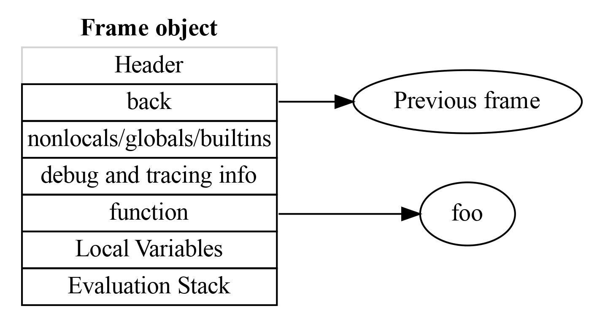
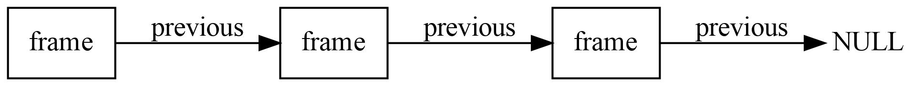
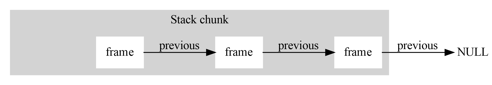
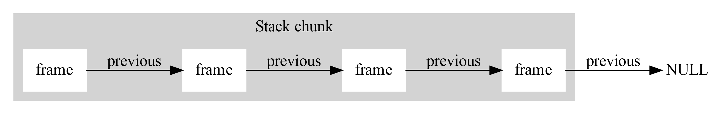
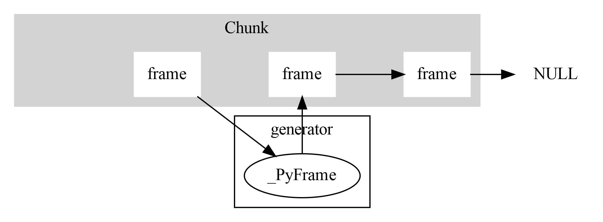
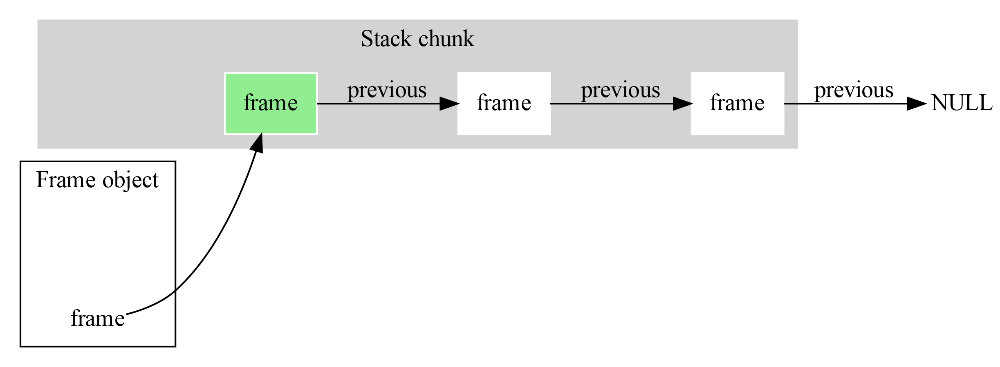
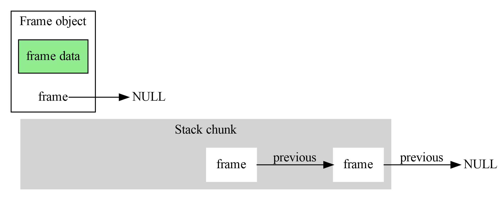

<br><br><br>
<br><br><br>
<br><br><br>
<br><br><br>
<br><br><br>

# Contiguous Frame Stack

<br><br><br>
<br><br><br>
<br><br><br>
<br><br><br>
<br><br><br>
<br><br><br>

---

# Python frames

Running code in any language (except old versions of Fortran) needs a stack.

```Python
def foo(x):
    return bar() + x
```

The value of `x` needs to be stored somewhere while calling `bar`, and since it is
possible that `bar` with call `foo`, we need a stack.





# The Python frame stack

As code executes, these frames form a stack. Up to Python 3.10, this stack
was implemented as a linked list, meaning that each function call needed a 
separate piece of heap allocated memory.

## Python 3.10



## Python 3.11

### Before Call



### After Call




# Handling generators, tracebacks and introspection.

## With a generator in the stack




# Creating a frame object

## Before


## After Creating a frame object



## After returning



