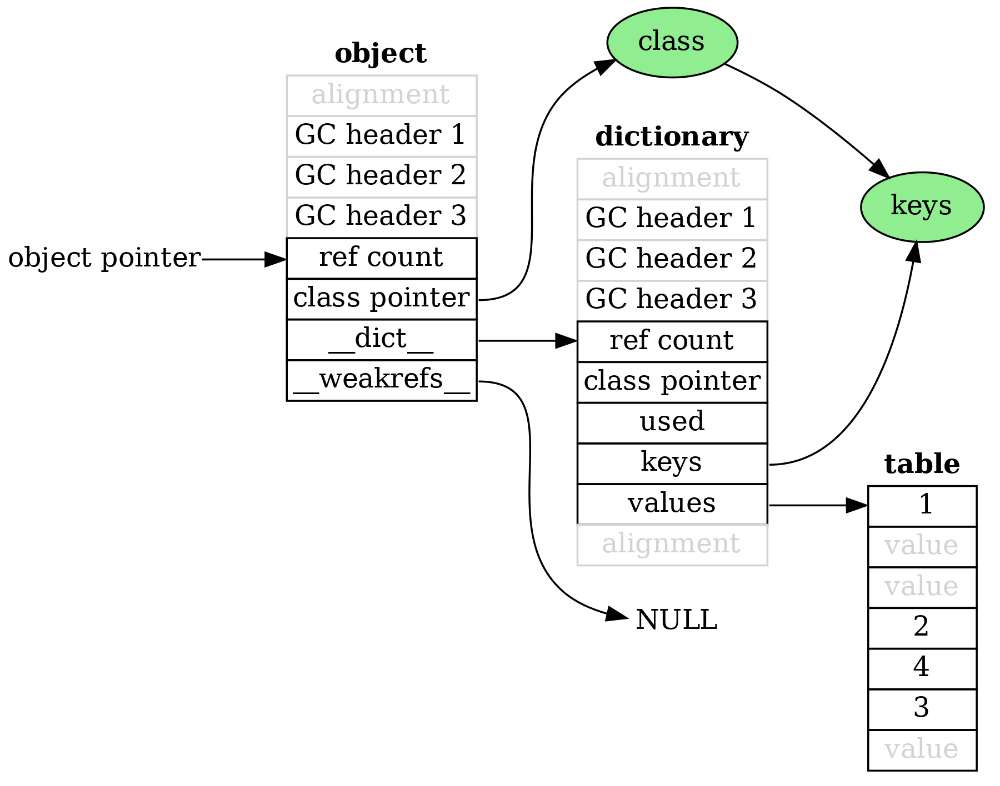
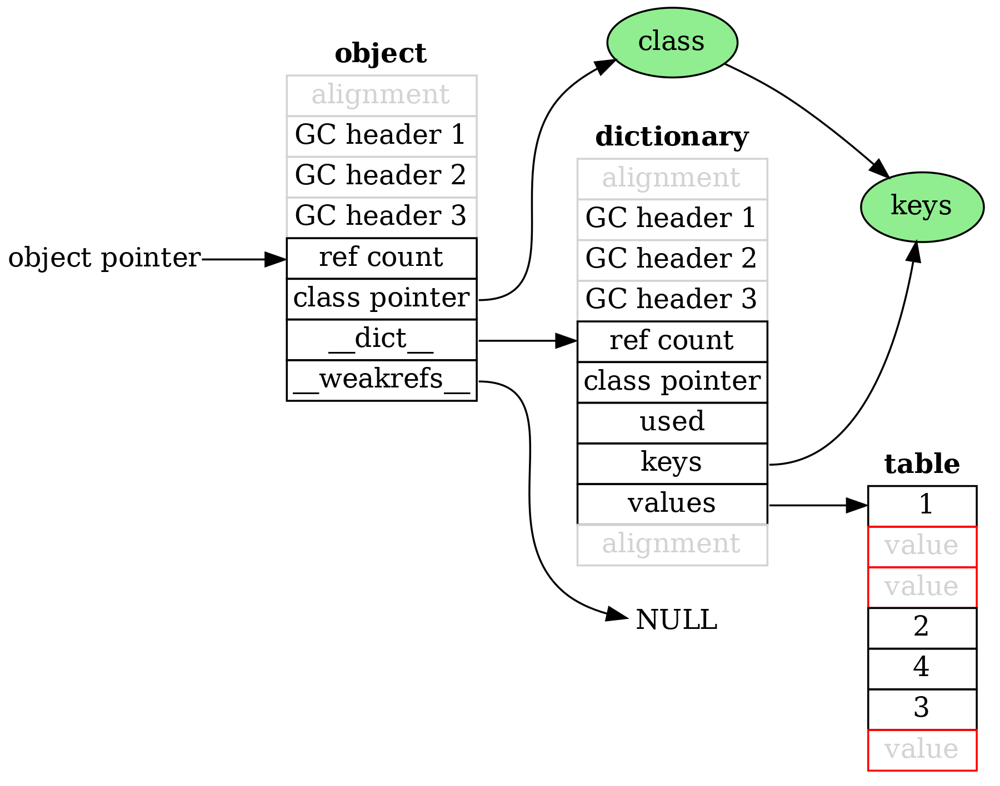
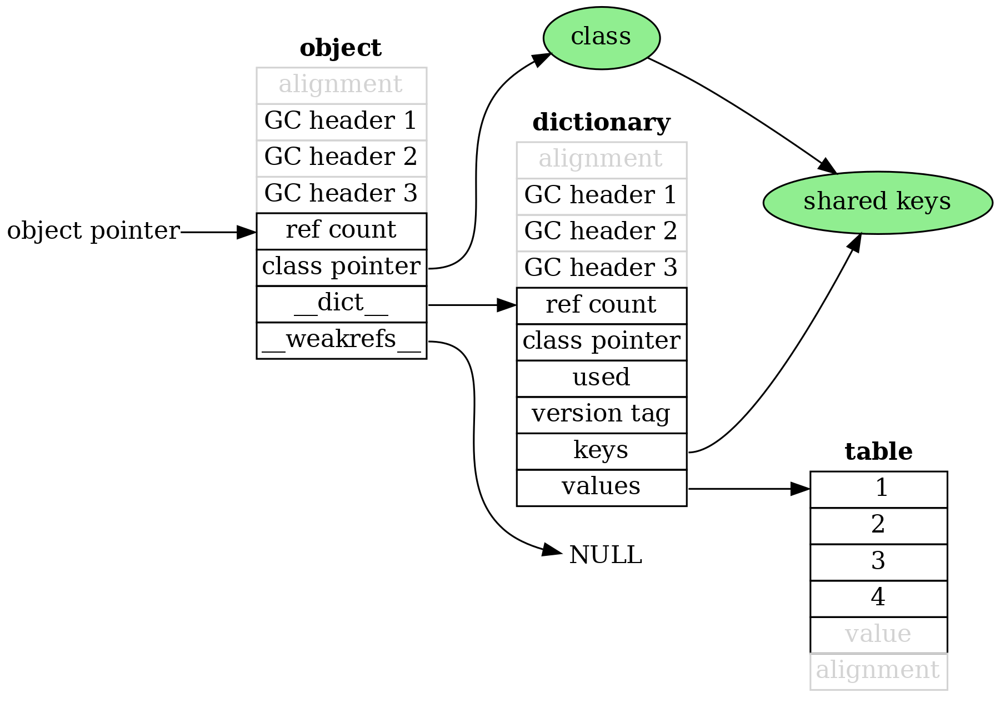
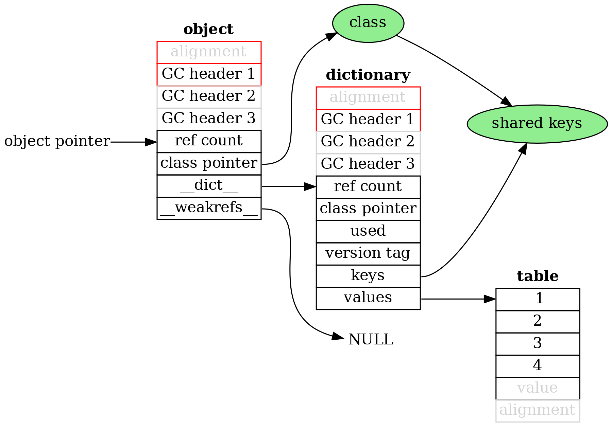
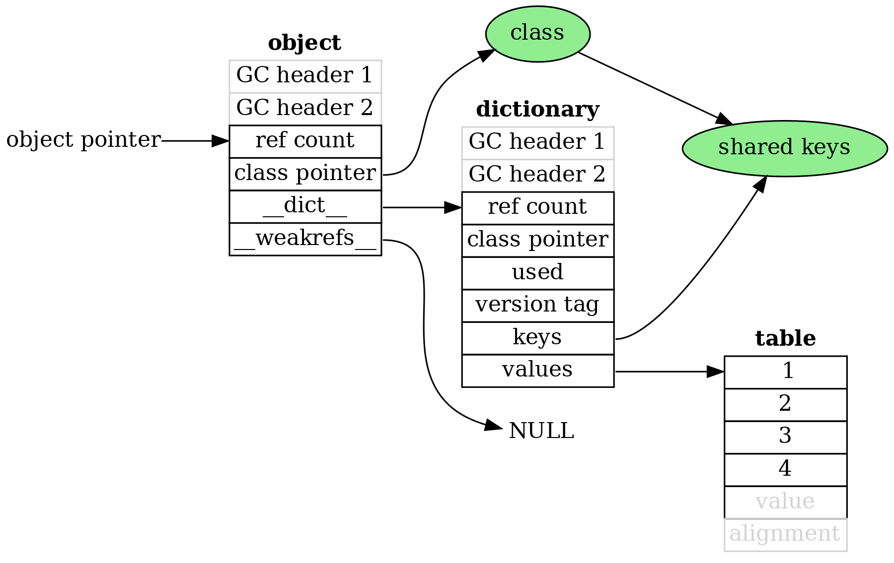
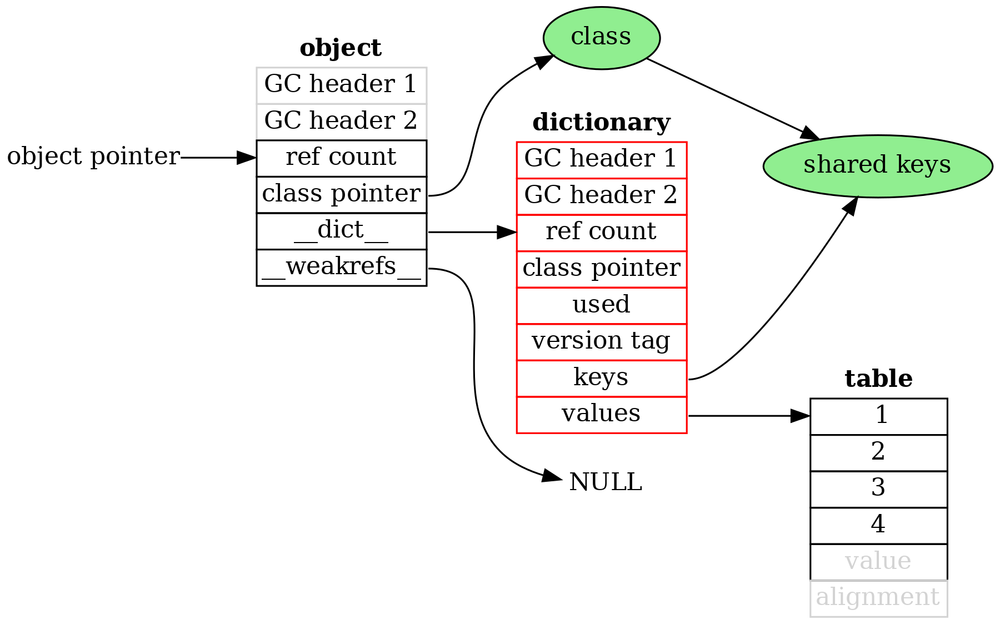
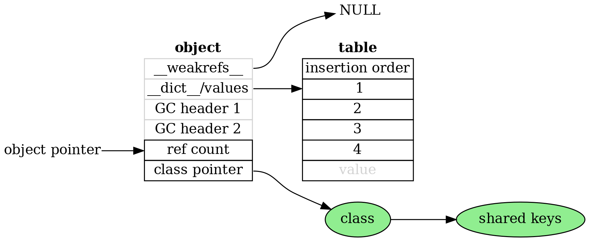

# The Shrinking Object of Python 

<br><br><br>
<br><br><br>
<br><br><br>
<br><br><br>
<br><br><br>
<br><br><br>
<br><br><br>
<br><br><br>
<br><br><br>
<br><br><br>

--- 

# Example class and instance

```Python
class C:
    def __init__(self, a, b, c, d):
        self.a = a
        self.b = b
        self.c = c
        self.d = d
```

```Python
>>> C(1,2,3,4).__dict___
{'a': 1, 'b': 2, 'c': 3, 'd': 4}
```


<br><br><br>
<br><br><br>
<br><br><br>
<br><br><br>
<br><br><br>
<br><br><br>
<br><br><br>
<br><br><br>
--- 

# The olden days. Python 2.7 & 3.2

All sizes are for 64 bit machine

### 352 bytes

* Object: 8 words
* Dictionary: 12 words
* Dictionary table: 24 words

Total: 44 words


--- 


--- 

## Python 3.3

PEP 412. The key-sharing dictionary

Share the keys and hashes between objects of the same class

### 208 bytes

* Object: 8 words
* Dictionary: 10 words
* Dictionary values: 8 words

Total: 26 words



--- 



--- 

## Python 3.6

Compact dictionaries

Store indexes of keys and values in sparse table. Store keys and values in compact array.

Also added a version tag (but that doesn't change memory use)

### 192 bytes

* Object: 8 words
* Dictionary: 10 words
* Dictionary values: 6 words

Total: 24 words




--- 




--- 

## Python 3.8

Smaller GC header

Squeeze information in `GC header 3` into low bits of `GC header 1` and `GC header 2`.


### 160 bytes

* Object: 6 words
* Dictionary: 8 words
* Dictionary values: 6 words

Total: 20 words




--- 



--- 

## Python 3.11

Virtual dictionary

Don't create the dictionary at all, unless specifically requested. All necessary information is in the class and values.


### 112 bytes
* Object: 8 words
* Dictionary values: 6 words

Total: 14 words


--- 

## Python 3.12

Move `__weakrefs__` into pre-header

### 96 bytes

* Object: 6 words
* Dictionary values: 6 words

Total: 12 words




--- 

## The future

One word GC header. Saturating ref counts.


### 80 bytes

* Object: 4 words
* Dictionary values: 6 words

Total: 10 words


Compare with:
* Java: 5 or 6 words
* C++:  4 words

| Language| Size (in bytes) |
| ---- | --- |
| Python 2.7 | 352 |
| Python future | 80 |
| Java | 40-48 |
| C++ | 32 |

--- 